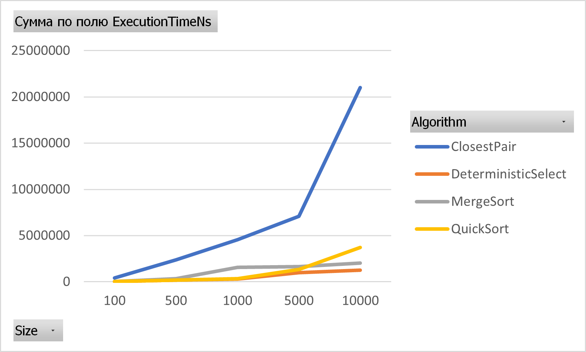
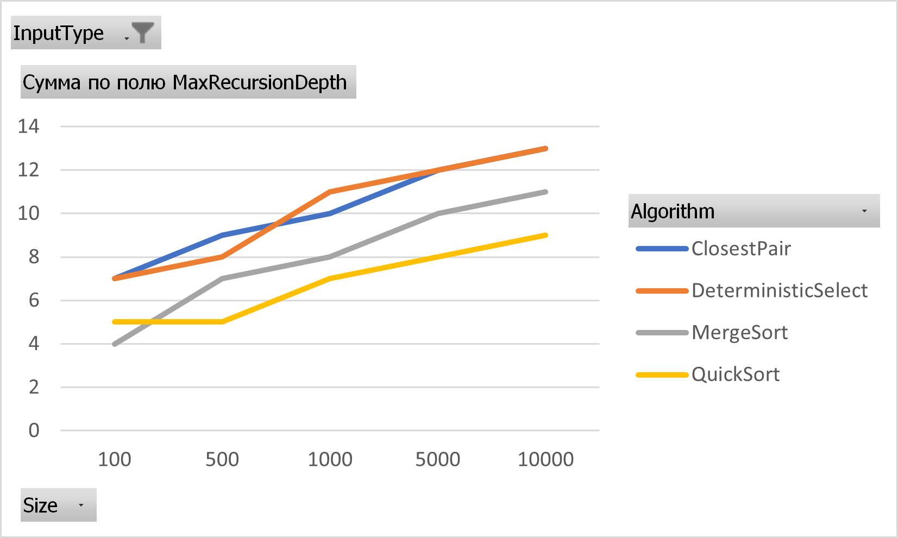
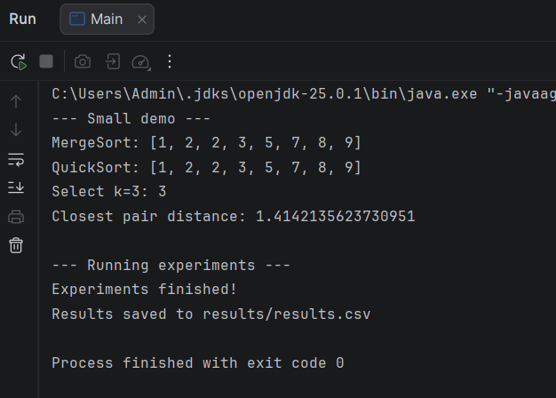
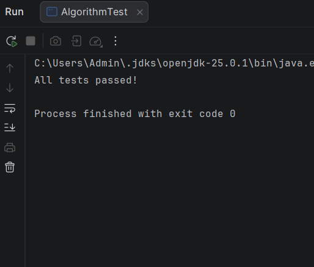
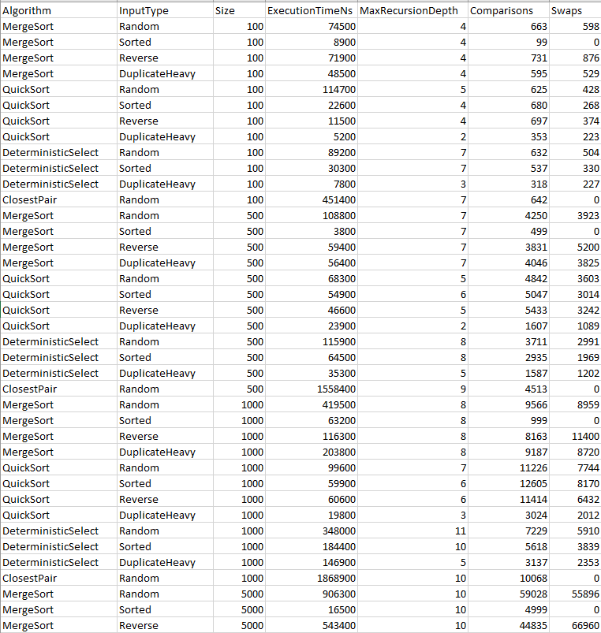
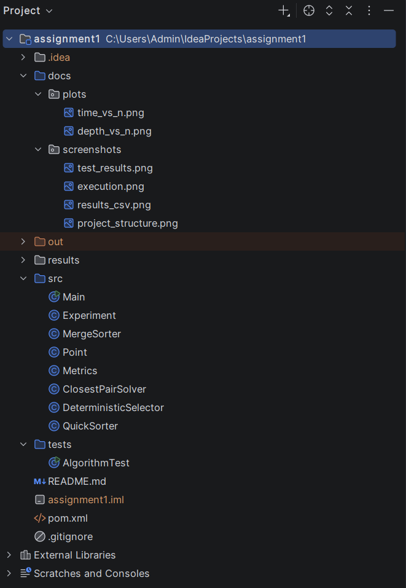

### A.Overview
The purpose of this assignment was to implement and analyze several divide-and-conquer algorithms and then compare their theoretical complexity with experimental results.
I implemented four algorithms:
- MergeSort
- QuickSort
- Deterministic Select (Median-of-Medians)
- Closest Pair of Points

The program also collects several metrics during execution: running time, maximum recursion depth, number of comparisons, and number of swaps. The experimental results are saved in `results/results.csv`.

### B.Algorithm Analysis
### MergeSort
MergeSort divides the array into two halves, recursively sorts both halves, and then merges them back together.
I used one reusable auxiliary array instead of creating a new array for every merge. For small subarrays, insertion sort is used with a cutoff of 15 elements.
There is also a check before merging. If the last element of the left half is already smaller than or equal to the first element of the right half, the merge can be skipped.
- The recurrence is: nT(n) = 2T(n/2) + Θ(n)
- Using the Master Theorem: T(n) = Θ(n log n)
- Time complexity: Θ(n log n) 
- Extra space: O(n)
- Recursion depth: O(log n)

### QuickSort
QuickSort chooses a random pivot and partitions the array around it.
My implementation uses 3-way partitioning:
- elements < pivot
- elements = pivot
- elements > pivot

This is useful when the array contains many duplicate values.
The algorithm recursively processes the smaller partition and handles the larger partition with a loop. This reduces the recursion stack size.
For a partition of size k, the recurrence can be written as: T(n) = T(k) + T(n-k-1) + Θ(n)

With reasonably balanced partitions, the expected complexity is: O(n log n)

The worst case is: O(n²)

The typical recursion depth is O(log n) because the smaller partition is processed recursively.

### Deterministic Select
Deterministic Select finds the element at position k without sorting the entire array.
The array is divided into groups of five. Each group is sorted and its median is found. The median of these medians is then used as the pivot.
After partitioning, the algorithm continues only in the partition that contains the required index k.
I also used 3-way partitioning so duplicate values can be handled efficiently.
The recurrence is approximately: T(n) <= T(n/5) + T(7n/10) + Θ(n)

The two recursive parts are small enough that the total work remains linear: T(n) = Θ(n)

Time complexity: Θ(n) in the worst case.

### Closest Pair of Points
The Closest Pair algorithm finds the minimum distance between any two points.
First, the points are sorted by their coordinates. The set is divided into left and right halves, and the closest distance is found recursively in both halves.
After that, a strip is created around the middle line. Only points inside this strip that can improve the current minimum distance need to be checked.

The recurrence is: T(n) = 2T(n/2) + Θ(n)

Using the Master Theorem: T(n) = Θ(n log n)

The brute-force solution takes Θ(n²) because it checks every pair of points. The divide-and-conquer version avoids most of these comparisons.

### Experimental Results
I tested all algorithms with input sizes from 100 to 10000. MergeSort and QuickSort were tested on random, sorted, reverse-sorted, and duplicate-heavy arrays. Deterministic Select used random, sorted, and duplicate-heavy inputs, while Closest Pair used random points.
I measured execution time with System.nanoTime(), recursion depth, comparisons, and swaps. The median execution times were saved to results/results.csv.

### Random Input Results

| Algorithm | n | Time (ns) | Max Depth | Comparisons |
|---|---:|---:|---:|---:|
| MergeSort | 100 | 74,500 | 4 | 663 |
| MergeSort | 1,000 | 419,500 | 8 | 9,566 |
| MergeSort | 5,000 | 906,300 | 10 | 59,028 |
| MergeSort | 10,000 | 1,062,600 | 11 | 128,076 |
| QuickSort | 100 | 114,700 | 5 | 625 |
| QuickSort | 1,000 | 99,600 | 7 | 11,226 |
| QuickSort | 5,000 | 723,700 | 8 | 68,713 |
| QuickSort | 10,000 | 1,033,500 | 9 | 164,575 |
| Deterministic Select | 100 | 89,200 | 7 | 632 |
| Deterministic Select | 1,000 | 348,000 | 11 | 7,229 |
| Deterministic Select | 5,000 | 293,200 | 12 | 39,032 |
| Deterministic Select | 10,000 | 430,800 | 13 | 82,312 |
| Closest Pair | 100 | 451,400 | 7 | 642 |
| Closest Pair | 1,000 | 1,868,900 | 10 | 10,068 |
| Closest Pair | 5,000 | 11,804,300 | 12 | 61,446 |
| Closest Pair | 10,000 | 18,407,900 | 13 | 132,885 |

The complete results for all input types and sizes are available in results/results.csv.

### Effect of Input Type
The input structure had a noticeable effect on the results.
For MergeSort with n = 10000:

| Input Type | Time (ns) | Comparisons |
|---|---:|---:|
| Random | 1,062,600 | 128,076 |
| Sorted | 33,900 | 9,999 |
| Reverse | 271,400 | 94,671 |
| Duplicate-heavy | 468,700 | 122,074 |

Sorted input was much faster because my MergeSort implementation checks whether the two halves are already in the correct order before merging them. If they are already ordered, the merge step is skipped.
For QuickSort with n = 10000:

| Input Type | Time (ns) | Max Depth |
|---|---:|---:|
| Random | 1,033,500 | 9 |
| Sorted | 1,028,100 | 9 |
| Reverse | 1,012,500 | 8 |
| Duplicate-heavy | 272,700 | 2 |

Random, sorted, and reverse-sorted inputs produced fairly similar execution times at this size. Duplicate-heavy input was faster and had a recursion depth of only 2 because the 3-way partition groups elements equal to the pivot together.
For Deterministic Select with n = 10000:

| Input Type | Time (ns) | Comparisons |
|---|---:|---:|
| Random | 430,800 | 82,312 |
| Sorted | 140,400 | 58,833 |
| Duplicate-heavy | 166,100 | 30,842 |

The duplicate-heavy input required much fewer comparisons than random input because equal values can be handled together during 3-way partitioning.

### Execution Time vs. n

The execution-time plot shows the general growth of the algorithms as the input size increases.
MergeSort and QuickSort had similar running times for the largest random input. Deterministic Select was faster because it does not need to completely sort the array.
Closest Pair had the highest measured execution time. The implementation works with `Point` objects and creates temporary arrays during the recursive process, which adds some practical overhead.
The timings are not perfectly smooth. For example, some smaller runs can take longer than expected. Java timing can be affected by JVM warm-up, JIT compilation, garbage collection, CPU scheduling, and other programs running at the same time.

### Recursion Depth vs. n

For random input, the maximum recursion depth was:

| n | MergeSort | QuickSort | Deterministic Select | Closest Pair |
|---:|---:|---:|---:|---:|
| 100 | 4 | 5 | 7 | 7 |
| 500 | 7 | 5 | 8 | 9 |
| 1,000 | 8 | 7 | 11 | 10 |
| 5,000 | 10 | 8 | 12 | 12 |
| 10,000 | 11 | 9 | 13 | 13 |

The recursion depth grows much more slowly than the input size.
MergeSort and Closest Pair repeatedly divide their input into smaller parts. QuickSort also keeps a relatively small recursion depth because only the smaller partition is processed recursively.

### D.Discussion
### Do the results match theoretical complexity?
In general, yes. MergeSort, QuickSort, and Closest Pair show behavior close to n log n, while Deterministic Select is closer to linear. The timings are not perfectly smooth because actual performance also depends on implementation and JVM behavior.

### How does input structure affect performance?
Input structure affected performance. MergeSort was much faster on sorted input because it can skip unnecessary merges. QuickSort handled sorted and reverse inputs well because it uses a randomized pivot. Duplicate-heavy input was especially fast for QuickSort because 3-way partitioning groups equal values together.

### Why does smaller-first recursion help QuickSort?
Processing the smaller partition recursively keeps the call stack small. The larger partition is handled with a loop, which helps maintain about O(log n) recursion depth.

### Why does Median-of-Medians guarantee O(n)?
Median-of-Medians chooses a reliable pivot using groups of five. This guarantees that a fixed part of the input is removed each time, giving a worst-case time complexity of Θ(n).

### Why is divide-and-conquer Closest Pair faster than O(n²) for large inputs?
Brute force checks every pair, giving Θ(n²). Divide-and-conquer splits the points and only checks necessary pairs near the dividing line, reducing the complexity to Θ(n log n).

### What practical factors affect performance?
Actual execution time can vary because of JVM warm-up, JIT compilation, garbage collection, CPU cache, and other running programs. Because of this, measured times do not always increase smoothly with input size.

### E.Reflection
The most difficult part of this assignment for me was implementing the algorithms while also keeping track of recursion depth and other metrics. QuickSort required extra attention because I had to use a randomized pivot and recurse only on the smaller partition. Closest Pair was also challenging because the points had to stay correctly ordered during the recursive steps.
The experiments helped me see the difference between theoretical complexity and actual execution time. The general growth of the algorithms matched the theory, but the measured times were not always perfectly smooth. I also saw that input structure can have a noticeable effect on performance, especially for sorted and duplicate-heavy inputs.

### F.Screenshots
### Program Output and 

### Test Results

### Experimental Results

### Project Structure

### Plots

